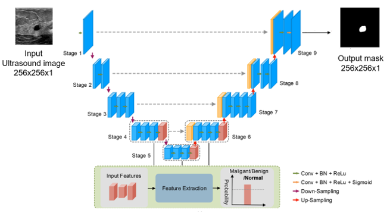

# Multitask learning for segmentation and classification of breast tumors from ultasound images
Breast cancer ranks as the most commonly diagnosed cancer and the top cause of cancer-related deaths in women worldwide. Although mammography is the standard screening tool, repeated radiation exposure may elevate cancer risk. Safer and more
efficient alternatives like breast ultrasound provide reliable and reproducible imaging without ionizing radiation.

Ultrasound (US) imaging serves as an essential tool for the early diagnosis of breast cancer. The integration of deep learning algorithms has introduced innovative methods for tumour detection and delineation in US scans. However, issues such as unstandardized datasets, limited image variety, and reliance on single-task models have reduced their practical effectiveness. This study investigates how multi-task learning can
address these shortcomings and enhance diagnostic precision.

A single architecture was designed to handle both segmentation and classification tasks with a unified feature extraction path. The backbone consists of a U-Net Architecture modified to handle both the tasks.

The widely used Breast UltraSound Imaging (BUSI) dataset was used for our study. It consists of 780 ultrasound images sepearted into three classes: Normal, Benign and Malignant. However, these contain several repeated and misclassified images. Hence, we used a curated version of the dataset. 

## UNet Structure with classifier

  
  
Figure: UNet structure modified with a classifier

  
  
Figure: Classifier Structure

We also implemented Gate units in place of the skip connections. The Gate Units had the following architecture:

  

## UNet++ Structure
The UNet++ Structure was also tested for the task. The following sturcture was implemented:

  

## UNet++ with Refined output
A block was added at the end of the segmentation output which used the classifier result to produce entirely black mask when the classifier gave output of Normal class (No tumor)

## Results
The scores for both segmentation and classification tasks (Malignant/Benign/Normal) using different architectures have been shown below:

  

## Segmentation Result

  
  
Segmentation Result for Tumor Case

  
  
Segmentation Result for Normal Case

